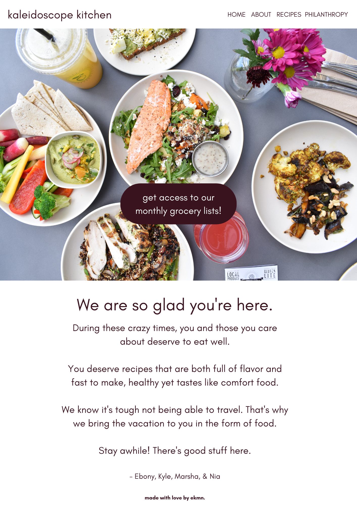

# Kaleidoscope Kitchen

 
## About 

The goal of Kaleidoscope Kitchen is to inspire people to try new recipes and awaken their palate to international flavors.

To accomplish this, we:
  - Designed a mockup on Canva,
  - Found inspiration from real-world food websites including: Minimalist Baker, Pinch of Yum, Hello Fresh, and Blue Apron

With the mockups and inspiration, we built simple-yet-beautiful webpages that really showcase the beauty of the food. See our homepage mockup below:

## Real-World Experience

It was also important to us that we gain real-world experience and build a potential client relationship. 

We took cues from the “COVID-19 responses” and non-profit partnerships you see on a lot of websites today, and we created a philanthropy page. 

We met with Dr. Theresa Holt, who runs a non-profit called ‘Helping Others Live Together’ in Stone Mountain, GA which delivers food and basic necessities to families with at-risk childen. Dr. Theresa had two problems:

1. She was backed up with requests from families on her personal cell phone number;
2. Her non-profit currently doesn't have a website or any solution to process requests from families.

On our philanthropy page, there is a form that families in need can fill out to receive a free box full of recipe ingredients. We used this as page to practice and test out what a digital solution could look like for HOLT Inc.

As a result, Dr. Theresa is open to continue working with us to build her website. 

## Goals
1. Make the site match the mockup as closely as possible.
2. Successfully build a Javascript/jQuery form.
3. Build a relationship with a potential client. 

## Challenges
We met 80% of our mockup goals at our combined level of skills and timeframe of 3 weeks. Some of the challenges with that include:
  - managing multiple stylesheets
  - customizing the template to look like our mockup
  - building and styling a consistent navigation bar 

## Building the Site

We coded our site using HTML, CSS, and JavaScript. 
We used One Page Wonder for the Bootstrap template: https://github.com/StartBootstrap/startbootstrap-one-page-wonder.git
 
 
## Credits
 
- Ebony Ford          https://github.com/emfordsvsu
- Kyle Lacy           https://github.com/360klacy
- Marsha David        https://github.com/mdavid2020
- Nia Laing           https://github.com/nialaing
 
## Review
 
Below are links to our website and group GitHub repository:
 
* The URL of the deployed application:https://github.com/nialaing/ekmn2
 
* The URL of the GitHub repository: https://nialaing.github.io/ekmn2/

